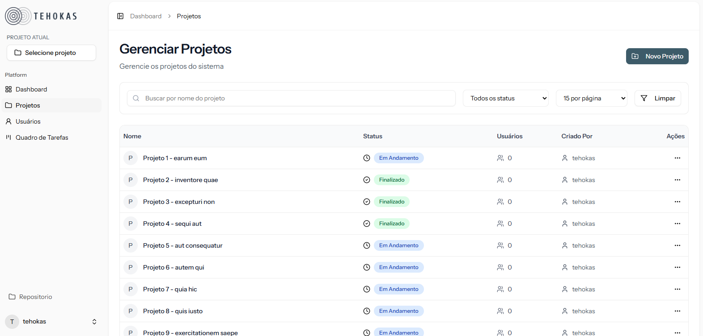
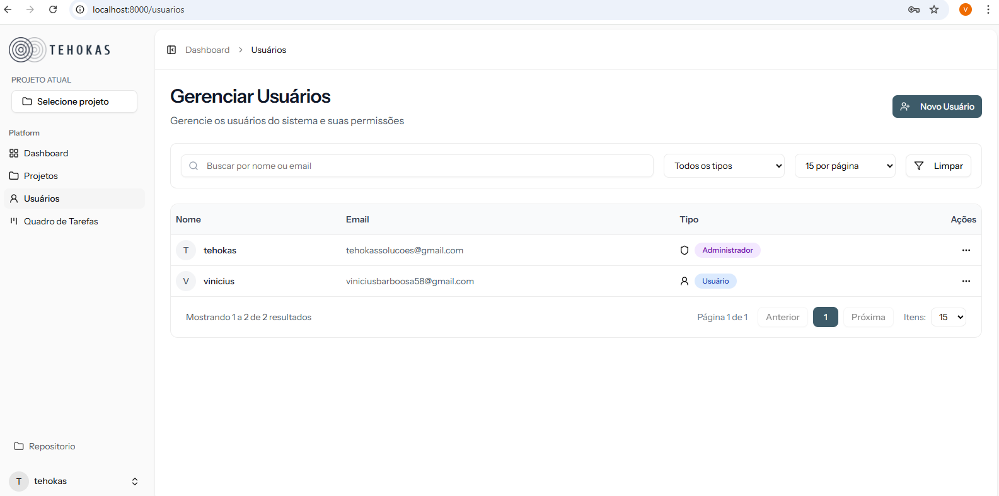
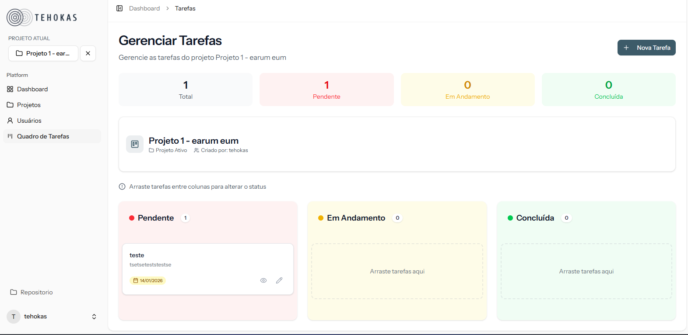
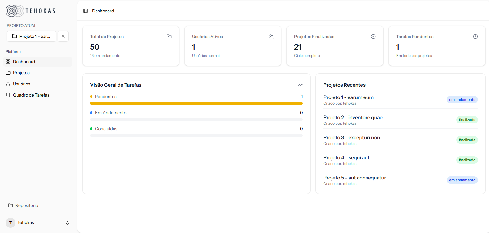

# Tehokas Task Management
Ferramenta de gestão de tarefas projetada para consultores otimizarem processos, garantindo visibilidade sobre o andamento de projetos e seus prazos.
Este projeto foi desenvolvido como parte do desafio técnico para a **Tehokas**, focando na criação de um MVP robusto, containerizado e com regras de negócio automatizadas.

---

# Deploy do projeto
Caso queria ver ele no ar
Link: https://srv1266759.hstgr.cloud/

#### 🔑 Credenciais de Acesso (Admin principal)

-   **E-mail:** `tehokassolucoes@gmail.com`
-   **Senha:** `tehokas123`

## Tecnologias Utilizadas

-   **Backend:** PHP 8.3 + Laravel 11.
-   **Frontend:** React (TSX) + Inertia.js
-   **Estilização:** Tailwind CSS
-   **Banco de Dados:** MySQL 8.0
-   **Infraestrutura:** Docker & Docker Compose

---

## Instalação e Execução

O ambiente foi configurado para ser "Zero Config". O script de inicialização (`start.sh`) automatiza a instalação de dependências, builds do frontend e migrações do banco.

### Pré-requisitos
-   Docker e Docker Compose instalados.

### Passo a Passo

1.  **Clone o repositório:**
    ```bash
    git clone https://github.com/viniciusbarboosa/tehokas-task-management.git
    cd tehokas-task-management
    ```

2.  **Configure o ambiente:**
    Duplique o arquivo de exemplo e renomeie para `.env` (ou use o comando abaixo):
    ```bash
    cp .env.example .env
    ```
    *Nota: As configurações de banco no `.env.example` já estão pré-configuradas para o Docker caso queira instalar via Dcocker deixe as que estão*

    #### Instalar via Docker

3.  **Suba os containers:**
    Este comando irá construir a imagem, instalar dependências (PHP/Node), rodar migrations e popular o banco de dados (Seeds)
    **Java Ira vim o usuario admin principal na instalação via docker Confira Abaixo o acesso para ele ou no topo do README é o mesmo usuário da Tehokas**
    Rode
    ```bash
    docker-compose up -d --build
    ```

4.  **Acesse a aplicação:**
    Aguarde alguns instantes para o script finalizar o setup. A aplicação estará disponível em:
    👉 **http://localhost:8000**

    #### 🔑 Credenciais de Acesso (Seeds)

-   **E-mail:** `tehokassolucoes@gmail.com`
-   **Senha:** `tehokas123`

  #### Instalação Local(Sem Docker)

  Caso prefira rodar a aplicação diretamente em sua máquina (sem usar containers), siga os passos abaixo

**Suba os containers:**
- **PHP 8.2+**
- **Composer**
- **Node.js 18+**
- **MySQL** (Serviço rodando localmente)

**Configuração do Banco de Dados**

 Copie e Cole o .env.example e ajuste as configurações para o seu ambiente local de acordo com seu banco de dados

Exemplo:

```bash
    DB_CONNECTION=mysql
    DB_HOST=127.0.0.1 # Ajuste aqui vem pre configurado para ambiente Docker
    DB_PORT=3306
    DB_DATABASE=tehokas
    DB_USERNAME=root
    DB_PASSWORD=
```

**Instalação das Dependências**
```bash
    # Bibliotecas do PHP
    composer install
    php artisan key:generate

    # Bibliotecas do JS
    npm install
```

**Rode as Migrations Popule o Banco de Dados**
```bash
    php artisan migrate:fresh --seed
```

#### 🔑 Credenciais de Acesso (Seeds)

-   **E-mail:** `tehokassolucoes@gmail.com`
-   **Senha:** `tehokas123`

**Executando o Projeto**

Abra 2 Terminais e Execute um pro php e outro pro Vite

- Terminal 1 (Backend):

```bash
    php artisan serve
```

- Terminal 2 (Frontend):

```bash
    npm run dev
```

---


# Funcionalidades

### 1. Gestão de Projetos

-   CRUD completo de Projetos podendo finalização
- Gerenciar e Colocar usuarios para fazer parte do projeto
- Pode Selecionar Projeto Ativo abaixo da logo da emrpesa na Sidebar

### 2. Gestão de Usuários

-   CRUD Usuarios

### 3. Kanbam das Tarefas

- Gerencia Tarefas
- Para aparecer as do Projeto selecione o projeto Correspondente

### 4. Dashboard

- Dados e estatisticas do projeto

